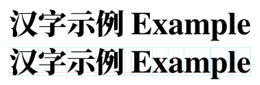

[简体中文](https://github.com/RuixiZhang42/font-pairing-guide)
/
[English](README-EN.md)

# Font pairing guide



## Introduction

When creating a document that consists of both Latin and CJK (Chinese, Japanese,
Korean) scripts, I&nbsp;often find that the Latin typefaces do not blend well
with the CJK ones in terms of their relative proportions: The Latin typefaces
often look too small compared with the CJK typefaces.

To solve this problem in LaTeX, one approach is to scale up the Latin typefaces.
For example, suppose that we want to use Times (or its clone) for Latin text and
for math, but scaled to&nbsp;108%. We can write
```latex
\documentclass{article}% default font size for body text is 10pt
\usepackage[no-math]{fontspec}
\setmainfont{TeX Gyre Termes}[Scale=1.08]
\usepackage[scaled=1.08]{newtxmath}
\begin{document}
Nominal font size for body text: \csname f@size\endcsname pt

Times clone font size: \the\fontdimen6 \font

Math font size: $\the\fontdimen6\space\textfont1\space$
\end{document}
```
Do you see the problems?
1. We have asked for a scale factor of&nbsp;1.08, but LaTeX gives us Times
scaled to 10.80002pt. What&rsquo;s up with the extra 0.00002pt?
2. The `newtxmath` package has an option to scale math fonts. But what about
other math font packages? For example, the (commercial) math font package
[`mtpro2`](https://www.pctex.com/mtpro2.html) does not have a `scaled` option.
To someone who purchases the &ldquo;Complete&rdquo; license,
this can be very frustrating.

## [`allow-frac-scale.tex`](allow-frac-scale.tex)

To address the first problem (the inaccurate scaling), I&nbsp;offer the file
[`allow-frac-scale.tex`](allow-frac-scale.tex). This file takes advantage of
eTeX&rsquo;s &ldquo;expressions&rdquo;, so you can write your scale factors in
*fractions* to get more accurate scaling results:
```latex
\input{allow-frac-scale}
\documentclass{article}% default font size for body text is 10pt
\usepackage[no-math]{fontspec}
\setmainfont{TeX Gyre Termes}[Scale=108/100]
\usepackage[scaled=108/100]{newtxmath}
\begin{document}
Nominal font size for body text: \csname f@size\endcsname pt

Times clone font size: \the\fontdimen6 \font

Math font size: $\the\fontdimen6\space\textfont1\space$
\end{document}
```

## [`mtpro2-patch.tex`](mtpro2-patch.tex)

For those who have licensed [`mtpro2`](https://www.pctex.com/mtpro2.html),
I&nbsp;offer the file [`mtpro2-patch.tex`](mtpro2-patch.tex). But first, you
need to manually fix 14 bugs in your `mtpro2.sty` file (please let me know if
you find more). Otherwise my patch file may produce errors. The instructions are
outlined at the beginning of the file.

This file started as a tool to scale the MathTime Pro&nbsp;2 fonts, but over the
years it grew to something much more. To use it, you write in your preamble:
```latex
\usepackage[<options>]{mtpro2}
\newcommand*\mtpscale{<scale factor>}% optional
\newcommand*\mtpscriptscale{<scale factor>}% optional
\newcommand*\mtpscriptscriptscale{<scale factor>}% optional
\input{mtpro2-patch}
```
Here are the features:
- Scale the entire MathTime Pro&nbsp;2 family according to your scale factor(s),
for both &ldquo;Lite&rdquo; and &ldquo;Complete&rdquo; versions.
- Some font bugs are fixed too: The parentheses of your binomial coefficients
are no longer overly large.
- Provide a `\mtp@bBigg@` command to help you create `\biggg`, `\Biggg`, etc.
- Fix the sizing of `\undercbrace` and `\overcbrace` when your font size is no
longer 10pt.
- Redefine `pmatrix` to always use large round parentheses, so you don&rsquo;t
need to write `\PARENS{\begin{matrix}...\end{matrix}}` anymore.
- Redefine `Bmatrix` and `cases` to always use the appropriate braces (they know
about curly, morphed, and straight braces).
- Provide `\tabularbin` and `\tabularrel` in case (pun intended) you want to
align your binary and relation symbols in `cases` or any stacked expressions.
- Provide `\cramped`, with an implementation slightly different from (and less
buggy than) the [`mathtools`](https://github.com/latex3/mathtools) version.
- Provide `\subalign` if you want alignment points in your subscript stacks.
- Finally, there are various fixes to the bugs I&rsquo;ve found in the
[`amsmath`](https://github.com/latex3/latex2e/tree/master/required/amsmath)
package and in the LaTeX2e kernel. These bugs were reported to the LaTeX team,
but they might never get fixed due to backward compatibility concerns.